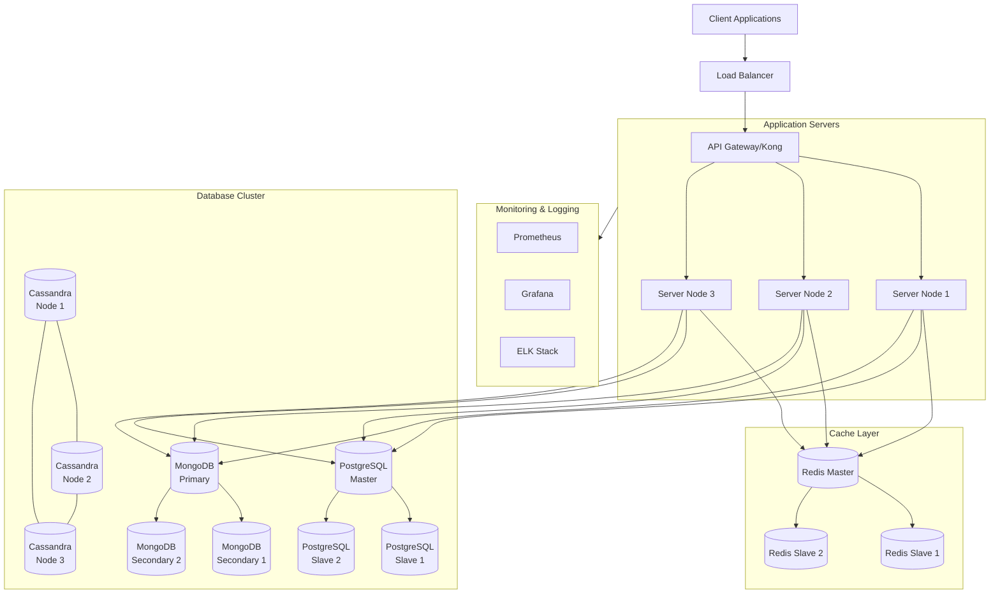

# Healthcare API Infrastructure Architecture



## 1. Load Balancing Layer

### Load Balancer Configuration
```nginx
# Example NGINX Load Balancer Configuration
upstream api_servers {
    least_conn;                              # Load balancing method
    server api-server1:8000 max_fails=3;     # Server 1
    server api-server2:8000 max_fails=3;     # Server 2
    server api-server3:8000 backup;          # Backup server
}

server {
    listen 80;
    server_name api.healthcare-analytics.com;

    location / {
        proxy_pass http://api_servers;
        proxy_set_header Host $host;
        proxy_set_header X-Real-IP $remote_addr;
    }
}
```

### API Gateway (Kong)
```yaml
# Kong Configuration
services:
  - name: healthcare-api
    url: http://api_servers
    routes:
      - name: main-route
        paths:
          - /api/v1
    plugins:
      - name: rate-limiting
      - name: jwt
      - name: cors
```

## 2. Application Servers

### Server Configuration
```yaml
# Server Instance Specifications
server_config:
  instance_type: t3.large
  cpu: 4
  memory: 16GB
  storage: 100GB SSD
  scaling:
    min_instances: 3
    max_instances: 10
    scale_up_threshold: 75% CPU
    scale_down_threshold: 30% CPU
```

### Auto-Scaling Rules
```yaml
auto_scaling:
  policies:
    - metric: CPU_UTILIZATION
      target_value: 75
      scale_out_cooldown: 300
      scale_in_cooldown: 300
    - metric: REQUEST_COUNT
      target_value: 1000
      scale_out_cooldown: 180
      scale_in_cooldown: 180
```

## 3. Database Architecture

### PostgreSQL Configuration
```ini
# Master Database
max_connections = 1000
shared_buffers = 4GB
work_mem = 32MB
maintenance_work_mem = 1GB
wal_level = replica
max_wal_senders = 10
max_replication_slots = 10

# Slave Configuration
hot_standby = on
hot_standby_feedback = on
```

### MongoDB Replication
```yaml
replication:
  replSetName: "healthcare_replica_set"
  oplogSizeMB: 10240
  enableMajorityReadConcern: true
  
security:
  keyFile: "/etc/mongodb/keyfile"
  authorization: "enabled"
```

### Cassandra Cluster
```yaml
cluster_config:
  num_nodes: 3
  replication_factor: 3
  consistency_level: LOCAL_QUORUM
  partitioner: Murmur3Partitioner
```

## 4. Caching Strategy

### Redis Configuration
```yaml
redis_master:
  maxmemory: 8gb
  maxmemory-policy: allkeys-lru
  save:
    - 900 1    # Save if 1 key changed in 15 minutes
    - 300 10   # Save if 10 keys changed in 5 minutes
    - 60 10000 # Save if 10000 keys changed in 1 minute

redis_slave:
  replication:
    slave-serve-stale-data: yes
    slave-read-only: yes
```

## 5. High Availability Setup

### Database Failover
```yaml
failover_config:
  postgresql:
    failover_timeout: 30s
    promotion_timeout: 30s
    master_monitor_interval: 10s
    
  mongodb:
    election_timeout_ms: 10000
    heartbeat_timeout_ms: 10000
    
  cassandra:
    read_repair_chance: 0.1
    dclocal_read_repair_chance: 0.1
```

### Backup Strategy
```yaml
backup_config:
  schedule:
    full_backup: "0 0 * * *"      # Daily full backup
    incremental: "0 */6 * * *"    # Every 6 hours
  retention:
    full_backup: 30d              # Keep for 30 days
    incremental: 7d               # Keep for 7 days
  storage:
    type: "s3"
    bucket: "healthcare-backups"
    encryption: "AES-256"
```

## 6. Monitoring Setup

### Prometheus Configuration
```yaml
global:
  scrape_interval: 15s
  evaluation_interval: 15s

scrape_configs:
  - job_name: 'api-servers'
    static_configs:
      - targets: ['server1:9090', 'server2:9090', 'server3:9090']
  
  - job_name: 'databases'
    static_configs:
      - targets: ['psql-master:9187', 'mongo-primary:9216', 'cassandra1:9103']
```

### Alert Rules
```yaml
groups:
  - name: api_alerts
    rules:
      - alert: HighLatency
        expr: http_request_duration_seconds > 2
        for: 5m
        
      - alert: HighErrorRate
        expr: rate(http_requests_total{status=~"5.."}[5m]) > 1
        for: 2m
```

## 7. Security Measures

### Network Security
```yaml
security_config:
  firewall_rules:
    - source: "load_balancer"
      dest: "api_servers"
      ports: [8000]
      
    - source: "api_servers"
      dest: "databases"
      ports: [5432, 27017, 9042]
      
  ssl_config:
    provider: "Let's Encrypt"
    auto_renewal: true
    protocols: ["TLSv1.2", "TLSv1.3"]
```

### Access Control
```yaml
rbac_config:
  roles:
    - name: "readonly"
      permissions: ["READ"]
    - name: "readwrite"
      permissions: ["READ", "WRITE"]
    - name: "admin"
      permissions: ["READ", "WRITE", "DELETE", "MANAGE"]
```

## 8. Disaster Recovery

### Recovery Plan
```yaml
dr_config:
  rto: "4h"    # Recovery Time Objective
  rpo: "15m"   # Recovery Point Objective
  
  failover_regions:
    primary: "us-east-1"
    secondary: "us-west-2"
    
  backup_strategy:
    type: "active-passive"
    sync_interval: "15m"
```

### Health Checks
```yaml
health_checks:
  endpoints:
    - name: "api-health"
      path: "/health"
      interval: "30s"
      timeout: "5s"
      healthy_threshold: 2
      unhealthy_threshold: 3
```
