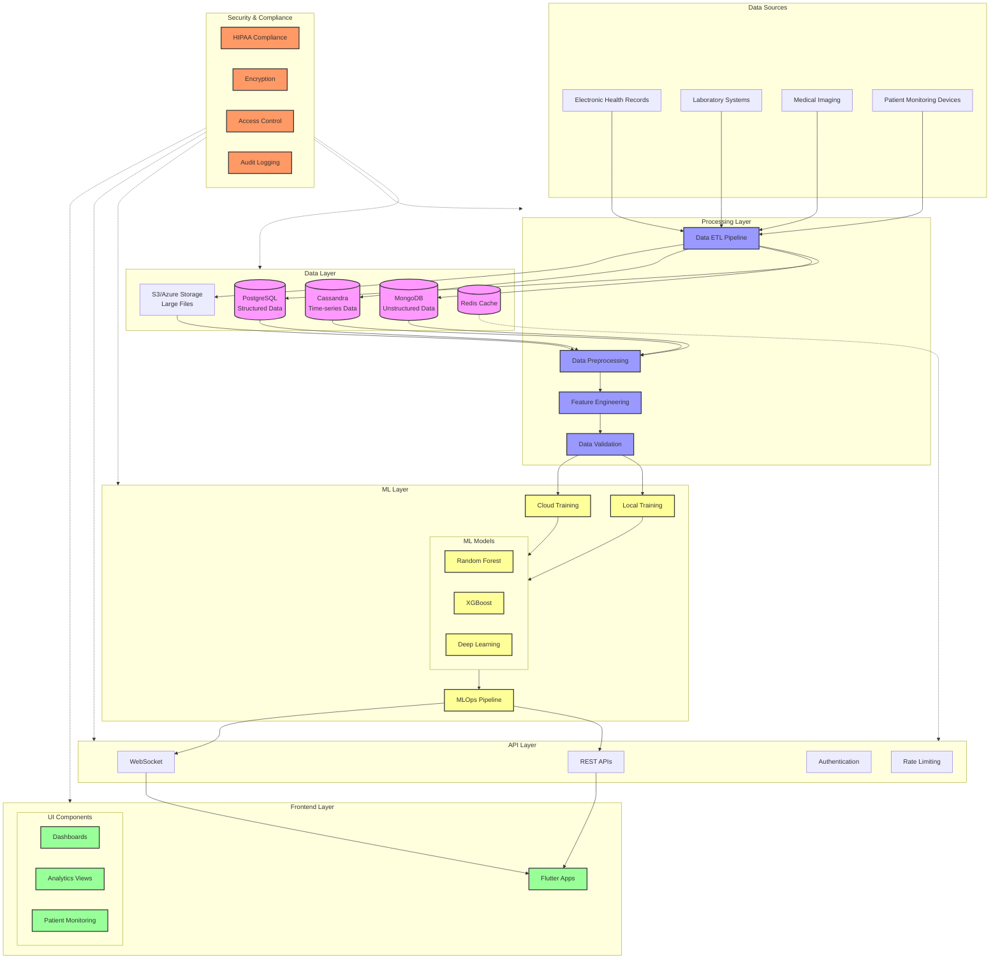

# Healthcare Analytics System Architecture

## Architecture Overview

### 1. Data Sources Layer
- Electronic Health Records (EHR)
- Laboratory Systems
- Medical Imaging
- Patient Monitoring Devices

### 2. Data Layer
- PostgreSQL: Structured patient data
- MongoDB: Unstructured medical data
- Cassandra: Time-series monitoring data
- S3/Azure Storage: Large files and images
- Redis: Caching and real-time processing

### 3. Processing Layer
- Data ETL Pipeline
- Data Preprocessing
- Feature Engineering
- Data Validation

### 4. ML Layer
- Local Training Pipeline
- Cloud Training Pipeline
- Model Types:
  - Random Forest
  - XGBoost
  - Deep Learning
- MLOps Pipeline

### 5. API Layer
- REST APIs
- WebSocket Connections
- Authentication/Authorization
- Rate Limiting

### 6. Frontend Layer (Flutter)
- Dashboards
- Analytics Views
- Patient Monitoring
- Real-time Updates

### 7. Security & Compliance Layer
- HIPAA Compliance
- Data Encryption
- Access Control
- Audit Logging

## Data Flow Description

1. **Data Ingestion**
   - Multiple data sources feed into ETL pipeline
   - Data is validated and routed to appropriate storage

2. **Data Processing**
   - Raw data is preprocessed
   - Features are engineered
   - Data is validated for quality

3. **Model Training**
   - Training occurs both locally and in cloud
   - Models are versioned and tracked
   - Performance is monitored

4. **API Integration**
   - Models serve predictions via APIs
   - Real-time updates via WebSocket
   - Secured and rate-limited access

5. **Frontend Delivery**
   - Flutter apps consume APIs
   - Real-time updates displayed
   - Interactive visualizations

6. **Security Overlay**
   - All layers protected by security measures
   - Continuous compliance monitoring
   - Comprehensive audit logging
